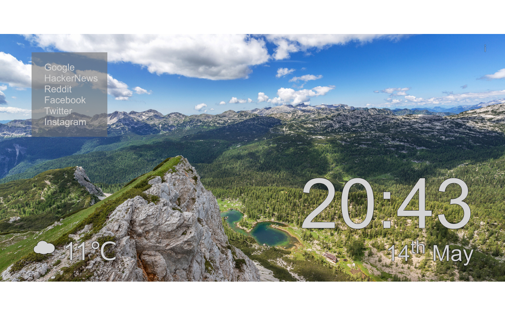

  ## Version 1.1
  
  

 Yesterday I released v1.0 of [my Chrome extension](https://chrome.google.com/webstore/detail/beautiful-new-tab/bailppllbndlpphoipdchcmiiefhelfh), and after finding a bug immediately after publishing it on the web store, I uploaded a fixed version 1.1 shortly afterwards. Version 1.2 is currently being published with another minor fix too.
 
This means it's done™! Not really though. It's not perfect and it does need some work, but it's polished enough to release now at least.

If you don't know - it changes the Chrome new tab page to another, much prettier page. It shows a random image from Unsplash, which are almost always gorgeous, as well as the date and time and the temperature and weather, which is pulled from OpenWeatherMap.

It's easy to install if you're on Chrome - just click "Add To Chrome" from the [extension's page](https://chrome.google.com/webstore/detail/beautiful-new-tab/bailppllbndlpphoipdchcmiiefhelfh) to download it. That's it, but you'll probably want to change its options, like which links it displays, from the options page.
 
## What isn't good
  
As I said, it's not perfect, particularly, the icon really needs changing. I'm just using a material cloud icon at the moment which doesn't really make any sense or fit or anything but look I'm no graphic designer.

It could use a better name too, I wasn't very creative with *Beautiful New Tab*. I was jokingly thinking of *Inertia* because it's a play on *Momentum* (the popular competitor extension).

If you have a good name suggestions seriously let me know (matt at rokco dot org), or if you want to donate an icon I would obviously be very grateful :smile:.

## Anything else?

You can look at the source on [my GitHub](https://github.com/xRokco/Beautiful-New-Tab) if you like.

I might make a more personal blog post, or a post about what else I've been doing or working on later or tomorrow.
