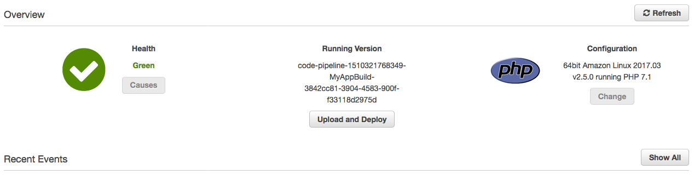
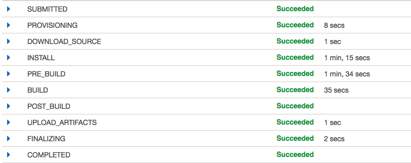

  Well, you'd hope I actually know them, seeing as I'm working for AWS as a Cloud Support Associate in the Deployment team, right? Being in Deployment means dealing with some of AWS's most interesting services such as CloudFormation, EC2 Container Service, CodePipeline and OpsWorks, but when I started I barely had a clue.

When I interned here last year I was in the same team, but the queue was pretty baron - we had a lot of very good engineers and the services were still only starting to get popular. I also only did CloudFormation and Elastic Beanstalk cases back then from deployment, which are fairly simple services compared to the others. Otherwise, I was falling back on only doing general Linux cases otherwise. AWS feels a lot busier these days, and there's always a case to be done, and it's more interesting.

Learning the new services has been great! I wish I had done so when I was doing nothing for the summer, or even better, last year when I was actually interning. This blog is probably the biggest achievement of anything non-experimental I've done yet using the AWS services (that is to say, I have some more technically impressive, proof-of-concept projects around, but none as usable or demonstrable as this blog).

## A Series of Tubes (or Pipes)

This blog, today, was finally moved off UCC Netsoc hardware onto AWS infrastructure. More than that though, it now uses a probably unnecessary pipelining and continuous integration service to ease building, deploying and updating it. Completely unneeded, but pretty cool none the less.



Pretty much all my sites; [rokco.org](http://rokco.org), [my film site](http://movies.rokco.org), [stijl.cc](https://stijl.cc) and [dEdZ.club](http://dedz.club) as well as this blog use CodePipeline and Elastic Beanstalk to handle deployment. These sites are all very, very simple static HTML sites, so it's pretty unwarranted to use these tools, but it is very slick, convenient and, most of all, it is free - you only pay for the actual EC2 computing services you use, the privileged of using CodePipeline or Beanstalk itself is free.

Now, I don't want to sound like some AWS shill (they do employ me after all), so I suppose I should say that I have no experience with any other, external, non-AWS services that do a similar job. So if you are in the market for a CI/pipelining service, shop around before taking my advice.

For all the sites listed above, sans this blog, the setup is very simple - CodePipeline is connected to the master branch of each Github repo and, when a change (any change), is pushed to master it redeploys onto Elastic Beanstalk automatically. No further actions needed by me.

I don't have or need a test/dev/staging environment for these projects, but they are easily setup with CodePipeline. You can add as many stages as you want really, and I have written CloudFormation templates which create Pipelines with Dev, Staging and Prod stages, and which all require different verifications before changes can be moved onto the next phase.

## What about for less simple sites?



This blog is the least simple site I have, even though it is still a static site. This blog is built with [GatsbyJS](https://www.gatsbyjs.org/), which is a React native static site generator with Node and other things. I don't really know. All I know is I write this blog post in Markdown, run `gatsby build` and then get a static html file which I can serve. 

Before today, the workflow was what I just typed above followed by copying these static html files via FTP onto a server. This wasn't convenient. I didn't like it. All the ease of being able to write in Markdown was nullified. May as well have used Vim to edit a html template.

CodeBuild (and CodePipeline) changed that. Now CodeBuild does the building! I start a blog post in the same way as before - write it in Markdown. Then, instead of building it I push it to my Git repo. CodePipeline sees this push and starts working. CodePipeline's first stage is a Build stage which is implemented with CodeBuild which runs a couple of commands, gets the output (the static html files), and then deploys only these to an Elastic Beanstalk environment.

Below is the buildspec.yml file, the config file which CodeBuild uses to know which commands to run in order to generate the static html files. It installs gatsby and then runs the build process. The output is everything (\*\*/\*) in the public/ directory.

```
version: 0.2
phases:
  install:
    commands:
      - touch .npmignore
      - npm install -g gatsby
  pre_build:
    commands:
      - npm install
  build:
    commands:
      - npm run build
artifacts:
  base-directory: public
  files:
    - "**/*"
```

These files are then deployed to a PHP Elastic Beanstalk environment (even though no PHP is used), without me having to do any fiddly moving of files around.

I like this automation. I find it cool, despite how very simple it is. This post doesn't even begin to mention the other bonus features you get for using AWS - the alarms, monitoring, load balancers, scalability, automation and security benefits offered can't really be easily beaten (and believe me, I don't say these kind things out of love for my company).