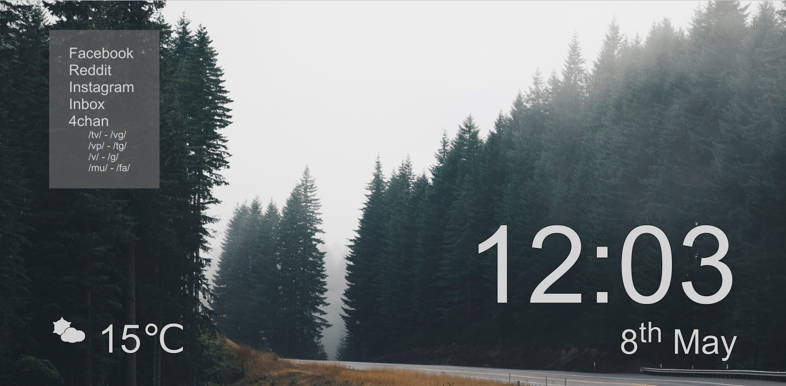

Yesterday I pushed an update to my small Chrome extension. The extension changes chrome://newtab to a different HTML page, with a (hopefully) beautiful image, a big clock, the current temperature and weather for the user's location, and a selection of links to my most used websites.

I'd always hated the default Chrome new tab page - the eight autogenerated links at the bottom of the page seemingly never went to the sites I wanted to go to, and most of the time their thumbnails were ugly or empty. To make it even worse, until [it was fixed](https://thenextweb.com/google/2017/05/08/google-chrome-new-page-asymmetry-fixed) the other day, the Google search bar was [asymetrical](https://thenextweb.com/google/2017/05/03/google-chrome-new-tab-not-symmetrical/) (not that anyone ever used that bar when the omnibox was autohighlighted anyway).

So I decided to make a new new tab page. 

## How it works

My extension pulls a random image from [Unsplash](https://unsplash.com/) and weather data from [OpenWeatherMap](https://openweathermap.org/). Unfortunately, for an image to look good on modern high resolution displays, they need to be very big. I use an XPS 13 with a 3200x1800 resolution display so even 1920x1080 images don't look quite sharp enough for me. Large images take time to download and display though, which is an issue. Initially, whenever the user opens a new tab an AJAX request was made to Unsplash and the random image download and set as the page background. The image would usually stutter and barely finish loading by the time the user had navigated away from the new tab page. With images that never finished loading I had essentially replaced my old new tab page with a plain black one.

To get around this, I decided to cache an image when the user visited the new tab page, and then display the image that was cached when the user visits the new tab page the next time. This meant that all loading was done in the background and all displaying of images was done from locally stored images, so there was virtually no delay on the image being displayed. The logic worked like this -

1. When the user opens a new tab page check if there's an image cached
  * If there is, get the cached image and display it
  * If no image previously cached (could be the first time they visit the new tab page after installing the extension), then show a local backup image.
2. After displaying an image, send an AJAX request to download a new image
3. Get the image from the AJAX request and cache it for the next time the user opens a new tab page

There were a few kinks with this plan, though - Chrome's localStorage API only accepts saving strings, not images, so I'd have to convert my image to a base64 URL for saving. Fortunately, I have worked enough with the HTML5 Canvas element to know how to do this. Chrome's localStorage API also seems to have a 5MB limit on it per origin. There is an unlimitedStorage permission that is meant to remove this cap, but it never seemed to work for me, and many sites cite a 10MB limit for Chrome normally, which again never worked for me. This storage limit was pretty minor though - while some images pulled from Unsplash could be larger than 5MB, especially after being converted to base64 (usually about 33% bigger than the original image), these were pretty rare, and if the image failed to save then the next time the user opens a new tab it would just show one of the equally pretty backup images.

There was one other big problem with the above logic though, which I proudly fixed with the update I just pushed. 

Converting an image to base64, especially large images, takes a *long* time. Most of the time, the user would have navigated away from the new tab page before the image has a chance to be processed and cached, so in 90% of situations a backup image gets shown. This was fairly easy to fix, but required I take more advantage of the things Chrome extensions offer, namely, running in the background.

The function to get, convert and save the images was moved to another script file which was allowed to run in the background. Then whenever a new tab was opened a message was passed from the main JavaScript file to call the image caching function. If the user moves away from the new tab page the function will continue running and (almost always) guarantee to cache an image, before going idle again until a new tab page is opened again.

## To do

There's still lots to work on if I ever want to think about publishing this extension though, I need -

* A settings page to let users change the links on it, and change things like Celcius to F, and 24 hour clock to 12 hour.
* A proper API key for Unsplash and OWM needs to be applied for, instead of using a developer one just for myself.
* The way the image is displayed in the HTML needs to be improved to better handle weirdly shaped images and vertical monitors.
* The image info sections needs a rewrite.
* Many more minor changes.

If you want to try it out from my [GitHub](https://github.com/xRokco/New-Tab) - there's installation instructions in the readme. Alternatively, you could help me think of a name for it. New new tab page isn't a great one.
