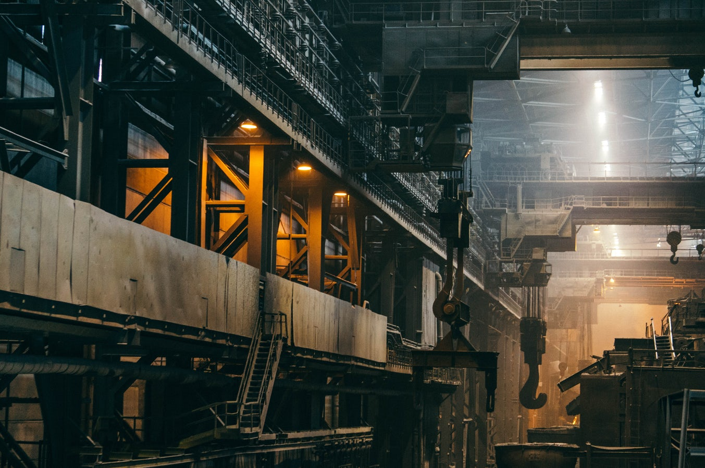

My da has been the union rep in his office for as long as I can remember. It's a position I've always been incredibly proud he's held, even when I was quite as socialist as I am now. It's an unpaid role that brings him a little satisfaction in a job otherwise baron of it. He's a mid level civil servant in the Property Registration Authority, and the whole building is strongly unionised.

## So, what jobs aren't unionised, and why aren't they? 

My job isn't, Cloud Support specifically. And I can't really think of any jobs in the technical sector in Ireland that have a strong union presence. Granted, I don't think I particularly need a union right now, but is it wise to ignore their usefulness? Unions aren't just for organising massive strikes, there are probably plenty of people who feel they were unfairly dismissed from a tech company and had no idea who to go to or how to go about fighting the sacking.

Thinking about the types of work which isn't known to have a union presence brought me to a somewhat distressing realisation - it's all "new" work.

The vast majority of the large companies and corporations who have popped up or come to Ireland in the last 50 years do not seem to have a strong union presence, this includes

* The tech sector
* Pharmaceutical companies
* Overseas grocery stores (like Lidl and Aldi, Tesco being the exception)
* Large fast food chains (like McDonalds or Dominos)

The only big unions for modern jobs I can really think of is in aerospace - cabin crew, ground crew and pilots all have quite strong unions, but this probably stems from the first airlines in this country being government owned (and pretty much all government run companies will be unionised).

Are people less interested in unions than the 70s? Are companies getting better at stopping them from getting a large backing in certain areas? Do people just feel like they don't need them any more? Or is this just a cultural trickling down, from the United States, of their attitudes towards trade unions in the 21st century?

The vitriol spat at the Luas, train and bus drivers over the last few years whenever they striked, both by the media and the general working class public, makes me think the bad influence of the States is at least partly to blame.