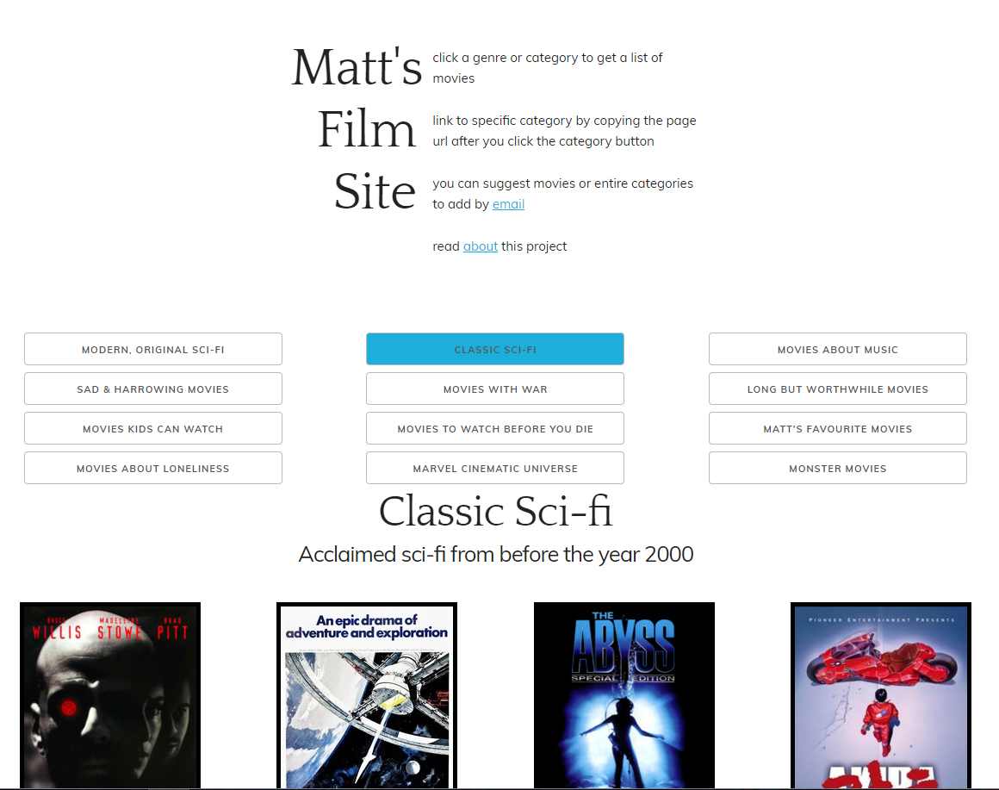

[Link to site](http://rokco.org/movies).

 People would often ask me for movie recommendations, so, instead of being helpful I automated the process!
 
 
 
 I built this little site so people would have an easier time choosing a movie to watch, especially when they are itching for a specific genre or type of movie. Sometimes you want a brainless action flick, sometimes you want to seem cultured and watch some Terrence Malick type film. Hopefully, for instance, if you've just finished [Cloverfield](http://www.imdb.com/title/tt1060277/) and you're asking "More like this?", this site will point you to something like [The Host](http://www.imdb.com/title/tt0468492/).
 
 As for finding a way to watch the movies, can't really help you there... maybe try [Netflix](https://netflix.com)? (or ask me really nicely).
 
 ## How it works
 
 This site is really simple, and the first version was built months ago when I barely knew how to programme (I've learned most of what I know in the last 14 months) and most of the core functionality is unchanged since then, so don't expect perfect code.
 
 All the movies and categories are stored in a big JSON file which populates the HTML. The JSON file is generated by another JavaScript file that calls the IMDb API and does some other text manipulation things. At the moment, all poster images have to be downloaded by me manually, but maybe I can try out some [better API](https://www.omdbapi.com/) to take care of posters in the future.
 
 ## Suggestions
 
 If you have some ideas for categories to add, or find a bug in the site, or just want to add some more movies you think are under-represented, please email me at matt@rokco.org.
