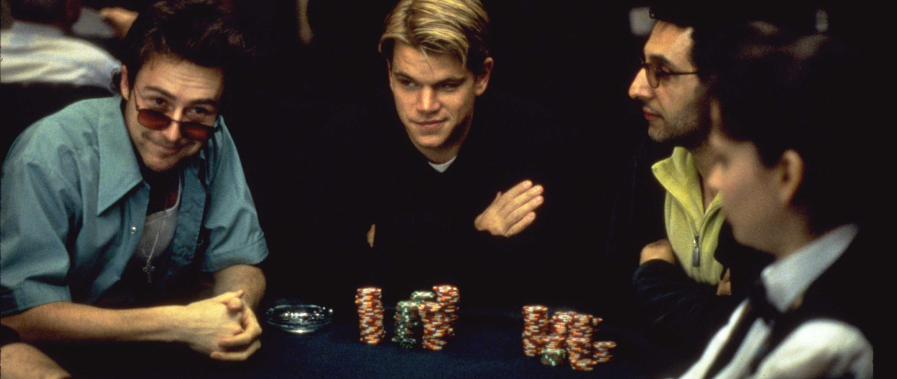
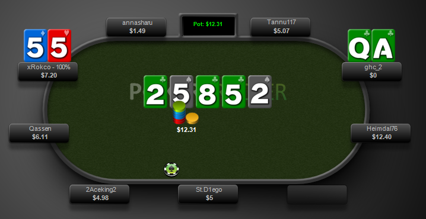

  Over the last few months I've spent a lot of time rediscovering old hobbies and finding new ones in order to try move on with my life. This has been really enjoyable because of all the free time I currently have to pursue them. Since moving back to Waterford at the start of summer I have started obsessing over
  
  * Overwatch
  * Path of Exile
  * PlayerUnknown's Battlegrounds
  * Dark Souls III
  * Web development stuff and this blog
  * Even Dota 2 again (a bit)
  * And Poker

The last one in that list is the big one, though. I've always loved Holdem. Since I started playing with family when I was ~13, and played for play money on Zynga Poker as a teenager I'd always wish I'd been able to play it more. And only a couple of weeks ago I realised I could! I started to watch a huge amount of poker, streams of people playing online, old episodes of High Stakes Poker and Vlogs and Youtube videos by professional players. I was amazed by just how in depth the concepts and strategy was, and just how many resources there were available, so it made learning it a lot of fun.

I didn't really want to talk about poker though, or how I've been getting on. Maybe another post for that. I really wanted to give my thoughts on Rounders.

## Rounders - that poker movie with Matt Damon

  

Rounders is a 1998 movie starring Matt Damon, Ed Norton and John Malkovich. In a word, it's *ok*. Not great, but there aren't many other enjoyable poker movies out there.

Matt Damon is his usual charming self, playing *Mike McDermott* a slightly less extreme version of his Good Will Hunting character - brilliant, talented (this time as a poker player), but refusing to perform.

Ed Norton is Mike's best friend, *Worm*, just out of prison and the most annoying human character I've ever seen in a movie ever. He does his best to fuck up his life, and in turn Mikes's, throughout the movie.

John Malkovich is a Russian mobster, *Teddy KGB*, who owns a poker club and is also a talented card player. Malkovich puts on a ridiculous accent/voice for his character that it's difficult to focus on what he's saying when he's talking, but at least it gave us [this](https://www.youtube.com/watch?v=1jUBbCgMWmE) famous scene.

## Yes but how well does Rounders respect poker?

This is definitely the most interesting thing about the movie. The answer to the above question is, in my opinion, pretty well. When Rounders is talking about poker it's not like CSI talking about hacking, for instance, and while it's not perfect it does a pretty good job.

It also doesn't just talk about Holdem. While Holdem is definitely the biggest game in the movie, it is aware that games like Stud, Draw and PLO exist, which is nice of them. It also uses a lot of terminology I recognise, even though the film is nearly 20 years old and some of the phrases I didn't understand might be simply old-fashioned (the term Rounders itself being one of these unfamiliar terms).

This biggest weakness I think the movie has about accurately representing poker I think is how it showed *skillful play*. The couple of climax moments throughout the movie generally revolved around *cooler* hands. *Cooler* hands are hands where both players cards are *really good*, and the loser of the cooler is generally really unlucky. For example, if you have a flush (five cards of the same suit), and one of your cards is an Ace, you generally have *the Nuts*. You almost never fold this hand. If the guy against you keeps raising you keep putting money in, right? You're pretty much guaranteed to win - your opponent must have a worse flush, or is trying to bluff you off this pot, right?

Well, sometimes your opponent is just lucky enough to get a better hand. It would usually be silly to play around this and lay down your nut flush. These cooler hands don't really show much skill - you got lucky, your opponent got even luckier and loads of money changed hands because of it. It happens. For what it's worth, here's a hand I won the other day - we were both all in after the Turn, him with the nut flush, me with the quads. You can't predict this, it's just unfortunate (for him, I was pleased).

Some of the really interesting hands to watch are when a player *does* lay a huge hand down. You can go on Youtube and find so many clips of players like Phil Ivey folding when he has a big set or some other massive hand because he reads that his opponent has him beat. Being able to remove the emotion and act logically even though you have an amazing hand is aa much more interesting display of skill than being dealt AA while your opponent gets KK.

This is never really gone over in the movie, and maybe that's fair. It would be much harder for casual audiences to appreciate this type of skill - winning with really good cards is a lot more fun than folding them - but I think that it could have been easily explained why *hero folding* is so impressive, especially as Mike does narrate throughout and explains his plays and the rules of poker.

Anyway, that's all I thought I guess. What an incoherent mess I am.