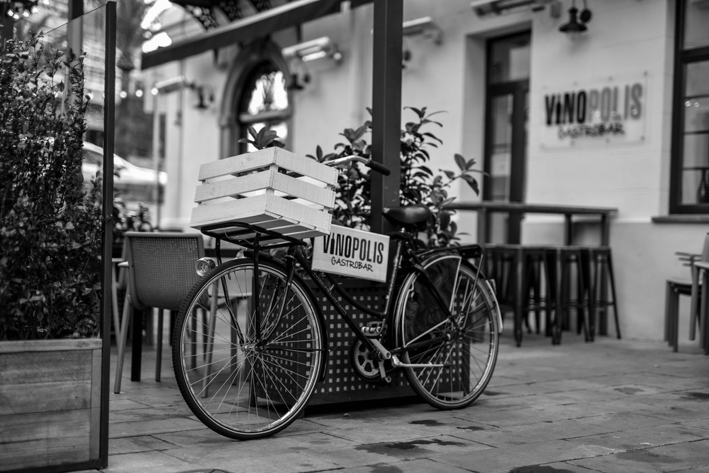

Here's what I've gotten delivered to my face from the awful, awful company Deliveroo, and what I thought of the food. All in Dublin, unless stated otherwise. I'll leave a star rating out of 5, and seeing as you can't get half star emojis I'll leave a .5 to indicate this.

## Rocket's

This is the modern burger joint spin-off of Eddie Rocket's, which has lately been trialling a new style of burger in their Baggot Street restaurant. These burgers are *good*. Very similar in style to Wowburger or Five Guys or all those American places everyone likes, which is a good thing. These are the best style burger. Not as many topping choices as the previously mentioned places, and the chips are only ok, but these are my favourite burgers in the city.

⭐⭐⭐⭐

## Smokin Bones

This place really surprised me. I thought it looked like a fairly ordinary, mediocre BBQ place and so skipped it for ages. I wish I hadn't. The White Alabama wings are literally all I think about right now. Maybe I'll get some tonight? And you know when you buy a takeaway and it comes with two free sides and you get the corn on the cob because you just want a bit of everything even though you have no intention of actually eating it? Well, the corn on the cob is fucken delicious! And the mac 'n' cheese!

Haven't even bought chips from this place yet.

⭐⭐⭐⭐⭐

## Fish Shack

Pretty small menu, but it did the job. I got the fried calamari, which was nice. Chips were good too but there's not too much more to say about a place like this. Will probably go back here and get a sandwich or something, they look a bit more interesting.

⭐⭐⭐

## Boojum

Look it's still just the best burrito in Dublin, but I'd never get it for dinner from Deliveroo any more. There's always one around the corner so just go there.

⭐⭐⭐⭐

## KFC

Maybe this is a guilty pleasure but sometimes you just want a big ole bucket of chicken. This is still the best for that I think, except for maybe Hillbilly's. But only the chicken (and gravy) is actually worthwhile. Sides are garb, you can't even get Coke, burgers are mediocre. Just get a bucket.

⭐⭐⭐.5

## Ciao

These pizza's are OK. Nice most of the time but I've had the odd bad one. Honestly would probably never order this place from Deliveroo, but I do live like 1 minute away so just walk there and save the €3 delivery. If it wasn't for that I'd probably never eat one.

⭐⭐.5

## Beshoff Bros

Pretty grand fish and chips, but the best part of Beshoff's is the Seafood Delight Box, and they don't offer that on Deliveroo so I would never bother.

⭐⭐

## Subway

I mean, it's Subway? I once just really wanted one so ordered one? That's usually not a good sign as the amount of Subway I eat directly corresponds to my depression.

⭐⭐

## Eddie Rocket's Diner

The original Eddie Rocket's, I only order from here when I want that awful cheese sauce they smother on their bacon cheese fries and hotdogs, which is fairly often actually.

⭐⭐⭐

## Saburritos

My ex and I used to order from here when we wanted Mexican that wasn't on a plasticy tent sized tortilla. Saburritos offer nachos and quesadillas and other things which are nice, but I have it on good authority that it is not good Mexican food (just slightly better than most other places).

⭐⭐⭐

## Crackbird

If I want some more expensive, more strongly flavoured fried check then this is a good place. Food can be a little too crispy for me or something. Batter seems a bit caramelized, but it's always tasted good. Tiny menu though so you'll only be going for one of their two chicken options.

⭐⭐⭐⭐

## Nando's

Honestly the Fino Pita is literally the perfect piece of food so I don't have anything bad to say about this place, despite the reputation.

⭐⭐⭐⭐.5

## Camden Rotisserie

Lovely onion rings, but I think the night I ordered and ate three portions was the night I stopped liking them. Like when you drink too many warm cans of Bulmers as a 16 year old and now it makes you gag? Food otherwise is grand but nothing amazing, except for the onion rings which are both delicious/revolting to me.

⭐⭐⭐.5

## Pitt Bros

It's alright BBQ. Found the food arrived a bit cold, but that might not be their fault. Probably would never order over Smokin Bones again.

⭐⭐⭐

## Klaw The Seafood Cafe

It's been a while now, but I didn't have a good experience with this place. Food was expensive, and I didn't like it very much in the end. Though the macaroni cheese was really poor. And then it had the audacity to stink the room up.

⭐

## Hanleys Cornish Pasties

Nice to get for lunch. I just love pastry so these are always going to be nice. Steak and Gravy was better than Beef and Stilton though. But two of them was also too much for any meal. Arrives very quickly too!

⭐⭐⭐.5

### Other restauants

Here's a list of other places I've ordered from but literally can't remember what I thought. They were probably fine but nothing special.

* Chai Yo
* Sanuk Thai
* Embassy Grill
* Al Boschetto
* Tung Sing (Cork)
* Royal Thai (Amsterdam)
* Sea Salt And Chocolate (Amsterdam)
* Yuan Ming Yuan (Cork)
* Aussie BBQ
* Fresca
* Ristorante Rossini (Cork)

*[Photo](https://unsplash.com/photos/3rKKOJ04qVU) by Denzel Victory on Unsplash*
