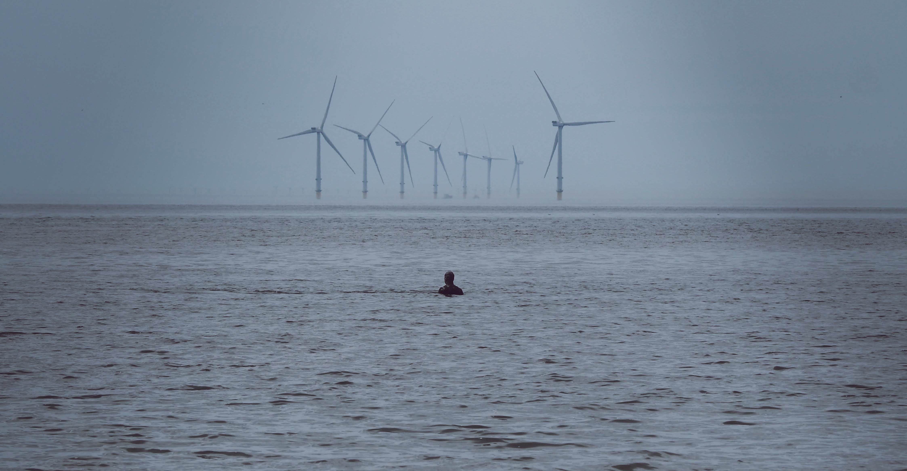

I'm not good at dealing with loneliness. I really struggle with being alone, no matter how much time I seem to get to practice being alone. And when I'm by myself I need to have all my senses bombarded by content just to try distract me. Even right now while writing this I have a podcast playing in the background and a basketball game on the TV. So afraid I am of having to think about my own existence.

Early January I decided I wanted to start going to the cinema again. When in college I used to go a couple of times a week to kill time during the weekdays, when tickets were cheap, but in the last two years I managed to lose all interest in films.

I never found going to the cinema to be particularly social endeavors. Many people won't dream of a solo trip to a film, but really, when it comes down to it, you will be sitting in a dark room silently for two hours. No reason you can't do it by yourself.

Going to the movies also seems to be one of the few things that does completely distract me from my own thoughts for its duration. I get to sit by myself for over two hours, completely focused on a single thing, without feeling compelled to refresh a news or social media app. It's a refreshing feeling.

But with this few hours of escapist bliss comes an equally powerful comedown. The 11pm walk home through a chilly, empty city while all I have to think about is the movie I've just been to and the fact I don't have anyone to share my opinion of it with is painful.

Luckily, this post-cinema melancholy doesn't seem to stop me from using my cinema pass by myself. I've done 13 cinema trips in the last month, all but two by myself.

If you want to see my surface level thoughts on those movies, you can [here](https://letterboxd.com/Rokco/films/diary/).

*[Photo](https://unsplash.com/photos/-Are4snbNOE) by Jack Hunter on Unsplash*
